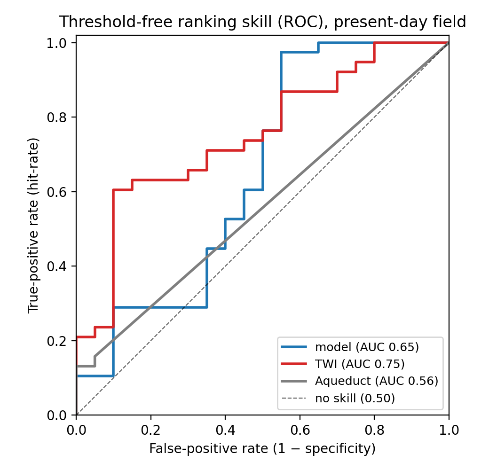
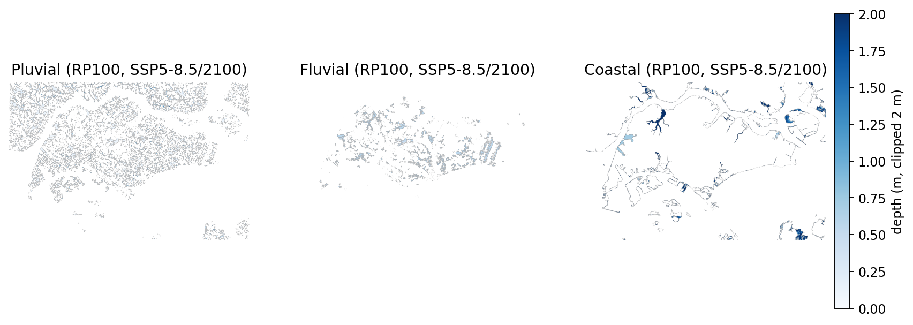

# A city-calibrated, open, commercial-safe multi-hazard flood model for Singapore: methods and validation against the official flood-prone register

*Daniel Phang.¹ ¹Affiliation TBD. Corresponding author: phang.daniel@gmail.com.
Target venue: Environmental Modelling & Software / Natural Hazards and Earth System Sciences
(methods + application). All quantitative results are produced by the project's validators and
mirrored from the internal methodology dossier; numbers are frozen at the commit recorded in
Data & Code Availability.*

---

## Abstract

Open, commercial-safe data now make it feasible to build city-scale flood models without
proprietary terrain or hydrology, but the open-data ecosystem has a structural gap: the
leading *open* global flood product provides riverine and coastal layers and **no pluvial
(rain-on-grid) layer**, even though surface-water flooding dominates in many drained tropical
cities. We present a 30 m, **fully open, commercial-safe multi-hazard flood model for
Singapore** — coastal bathtub on tide-gauge GEV water levels with AR6 sea-level rise;
Height-Above-Nearest-Drainage fluvial; and a local-inertial rain-on-grid pluvial layer on an
independently derived bare-earth DEM — and validate it against authoritative documented ground
truth using a **documented-register benchmark**: scoring the model against the official
register of flood-prone locations a city authority maintains, alongside the open alternatives
a practitioner would otherwise use. For Singapore we score against all 36 areas of the PUB
*List of Flood-Prone Areas* (Nov 2025),
authoritatively geocoded, plus two historical events (38 positives), and 20 dry controls, and
report the True Skill Statistic and a threshold-free ROC-AUC, each with paired bootstrap
confidence intervals. The result is a clean precision–recall split. On **combined location
skill** the calibrated model and a naive Topographic Wetness Index are **statistically
indistinguishable** — confirmed by both TSS (every ΔTSS interval spans zero) and ROC-AUC
(ΔAUC −0.10, CI spans zero) — because the official register is overwhelmingly low convergent
ground a wetness index captures almost perfectly. On **specificity**, however, the calibrated
model is **significantly better**: a naive index floods low ground indiscriminately
(it wrongly wets 14/20 documented-dry points, and 78 % of a neutral random land sample),
whereas the drainage-aware model wrongly wets far fewer (paired ΔCRR +0.35, 95 % CI
[+0.10, +0.60] on the curated negatives; +0.55 [+0.40, +0.68] on a model-blind random
negative set). The advantage is robust to the hit-radius and holds against a second,
structurally independent naive baseline. The model also provides pluvial **coverage** the
generic global vendor structurally lacks (it flags 15/38 register points to the vendor's 3;
Δ hit-rate +0.32, CI excludes zero). The model delivers, on open commercial-safe inputs, a
validated multi-hazard product whose value lies in **precision, depth-resolved hazard, and
mechanism** rather than in out-locating free topography — and the documented-register
benchmark is what lets that value be stated honestly and reproducibly. We release the model,
the benchmark, and the register openly.

**Keywords:** pluvial flooding, urban flood model, open data, multi-hazard, validation, True
Skill Statistic, ROC-AUC, Singapore, rain-on-grid, sea-level rise.

---

## 1. Introduction

City-scale flood modelling has historically required proprietary terrain and hydrological
data. The maturation of open, commercial-safe datasets — global 30 m DEMs, tide-gauge
records, IPCC AR6 sea-level projections, and published rainfall statistics — now makes a
fully open model feasible. Yet two questions remain under-examined: (i) does an open,
city-calibrated model actually outperform the freely available alternatives a practitioner
would otherwise reach for, and (ii) against what ground truth should such a claim be judged?

This paper makes three contributions. (1) **A model:** a fully open, commercial-safe,
multi-hazard (coastal/fluvial/pluvial) flood model for Singapore at 30 m, including an
independently derived bare-earth surface (avoiding the non-commercial FABDEM) and a
physically based, local-inertial rain-on-grid pluvial layer — the layer the open vendor lacks.
It is a *screening-grade* product (§6), not an engineering design model. (2) **A validation method:** a documented-register
benchmark that scores the model — and the open alternatives a practitioner would otherwise use
— against the authoritative register of flood-prone locations a city authority maintains, with
documented dry controls and bootstrapped skill statistics. (3) **An honest performance
profile:** a characterisation of where the calibrated model adds value and where it does not.
The framing is deliberately narrow: not that an open model rivals a calibrated commercial
engine, but the question a prospective user asks — *does a city-calibrated open model beat the
open alternatives (a generic global vendor and a naive topographic method) at the flood
behaviour a city authority documents, and on which axis?*

### 1.1 The open-data pluvial gap

The leading open global flood product (WRI Aqueduct) provides riverine and coastal hazard but
**no pluvial layer**. In a heavily drained equatorial city such as Singapore, where the
dominant flood mechanism is short-duration rainfall exceeding drainage capacity, this is the
decisive gap: the best open global vendor cannot, by construction, flag the pluvial flooding
that dominates locally. This is not a modelling failure of the vendor; it is a structural feature of
the open-data landscape, and it is the opportunity the present work targets.

### 1.2 A documented-register benchmark

Flood-model validation is usually reported against either modelled benchmarks or sparse,
opportunistic high-water marks. We propose instead to anchor validation to the **official
register of flood-prone locations** a city authority maintains and updates — for Singapore,
the PUB *List of Flood-Prone Areas*. Such registers are authoritative, current, and
falsifiable: they encode where the responsible agency has determined flooding occurs. Scored
with a skill statistic that includes documented **dry controls**, a register yields a
comparative test that is cheap to reproduce in any city that publishes one, and that cannot be
gamed by a model that simply floods all low ground.

### 1.3 Commercial-safe by construction

Every input is open and licensed for commercial use: Copernicus GLO-30 terrain (ESA/Airbus,
2022), UHSLC tide gauges (Caldwell et al., 2015), IPCC AR6 sea-level projections (Fox-Kemper
et al., 2021), published rainfall IDF statistics, and the PUB register (PUB, 2025), geocoded
via SLA OneMap (SLA, 2024). Building footprints come from Google Open Buildings v3 (Sirko et
al., 2021). Notably, the popular FABDEM bare-earth product is **excluded** (non-commercial
licence); we derive a bare-earth surface independently (§3.1).

---

## 2. Study area and data

Singapore (~735 km²) is low-lying, intensely drained, and equatorial, with flooding dominated
by short, intense convective storms exceeding drain capacity. We model three hazards at 30 m:
pluvial (the layer carrying the comparative claim), and coastal and fluvial (validated to a
plausibility standard; §3.4).

**Ground-truth register.** The positive ground truth is all **36 entries** of the PUB *List
of Flood-Prone Areas* (Nov 2025), each geocoded via the Singapore Land Authority's
authoritative OneMap gazetteer rather than by hand, plus two depth-bearing historical events
(Stamford Canal / Orchard Road ~0.4 m, 2010; Bukit Timah Road ~0.25 m) that PUB has since
drainage-upgraded off the list — **38 positives** in all. We add **20 dry controls** in two
tiers: elevated parkland and reserves (robust true negatives), and developed town centres
that are low-lying but absent from the comprehensive PUB list (discriminating negatives that
a model which merely floods low ground will fail). All controls are OneMap-geocoded and
DEM-verified not to sit in a topographic sink, and were selected by a neutral rule before any
model output was examined. The register is fixed before scoring, so it cannot be reverse-fit.

---

## 3. Methods

**Figure 1.** Open multi-hazard pipeline and documented-register validation.

### 3.1 Terrain and bare-earth surface

We use Copernicus GLO-30 as the base terrain. GLO-30 is a digital *surface* model: it includes
buildings, whose raised roofs and the artificial inter-building voids between them generate
spurious micro-pits that break rain-on-grid routing. Because the commercial-safe constraint
excludes FABDEM (CC BY-NC-SA), we derive a bare-earth surface independently from open inputs.
Building footprints from **Google Open Buildings v3** (CC BY-4.0; Sirko et al., 2021) are rasterised to a per-cell
building-coverage fraction; cells whose coverage exceeds 0.25 are treated as building-
contaminated, removed, and the ground beneath them reconstructed by inverse-distance infilling
from surrounding open (road / park / water) cells (`rasterio.fill.fillnodata`, 50-cell search
radius, two smoothing passes). Singapore's dense road grid guarantees well-constrained nearby
open cells, so the infill is tightly constrained; a light 3×3 median filter then suppresses
residual cell-to-cell DSM noise. The resulting bare-earth DEM is conditioned hydrologically for
rain-on-grid routing with a **surgical de-pitting** step that fills only spurious sub-sea-level
and unphysically deep enclosed depressions (surface-model artefacts), preserving genuine shallow
hollows. The bare-earth construction (Open Buildings coverage, threshold, infill) is itself an
open, commercial-safe substitute for FABDEM.

### 3.2 Pluvial — local-inertial rain-on-grid

Surface-water depth is computed with a local-inertial shallow-water solver (Bates et al., 2010)
applied as rain-on-grid: a net-excess rainfall depth (design IDF minus drainage capacity) is
distributed over the conditioned DEM and routed to equilibrium. The domain perimeter is an
open outlet (runoff routed off-map drains rather than ponding against a wall), and peak depth
is capped at a documented 3.0 m engineering life-safety limit. Rainfall is scaled per climate
scenario by a Clausius–Clapeyron factor on the projected temperature change (Lenderink & van
Meijgaard, 2008).

### 3.3 Fluvial — Height Above Nearest Drainage

Fluvial inundation uses HAND (Nobre et al., 2011) relative to the drainage network, with engineered channel cells
masked (the surface model captures canal beds below grade, which would otherwise appear as
spurious flooding).

### 3.4 Coastal — bathtub on GEV water levels

Coastal inundation is a bathtub fill on a still-water level `WSE = MSL + tide + surge + SLR`,
with extreme levels from a GEV fit (Coles, 2001) to UHSLC tide-gauge records (Caldwell et al.,
2015), the EGM2008 geoid offset applied (Pavlis et al., 2012), and AR6 sea-level-rise deltas
added per scenario (Fox-Kemper et al., 2021). With no defences or pumping
represented, coastal extent is a **screening upper bound** (§4.4).

### 3.5 Validation framework

**Skill metrics.** For each model and baseline we sample a neighbourhood (150 m radius,
absorbing DEM horizontal error and georeferencing uncertainty) at each register point and
report:
- the **True Skill Statistic**, TSS = hit-rate + correct-reject-rate − 1 (Peirce, 1884;
  Hanssen & Kuipers, 1965), with documented dry controls (a model that floods everything scores
  ≈ 0); and
- a threshold-free **ROC-AUC** (Hanley & McNeil, 1982) that ranks the continuous depth/index
  field, giving each method its own optimal operating point and removing dependence on any
  single depth cutoff.

Because the register is modest (tens of points), every statistic carries a **95 % stratified
bootstrap confidence interval** (Efron & Tibshirani, 1993), and model-vs-baseline comparisons
use a **paired bootstrap**
on the difference (same resampled points applied to both methods). A comparative claim is
treated as supported only if the paired interval excludes zero.

**Baselines.** The binding comparison is against open methods a practitioner could run for
free: (i) a **naive Topographic Wetness Index** (TWI = ln(a/tan β); Beven & Kirkby, 1979),
flagging the wettest ~15 % of land; (ii) a second, structurally independent naive method, a
**Topographic Position Index** (local depression depth, no flow routing); and (iii) the generic
global vendor (WRI Aqueduct; Ward et al., 2020), reported as the structural reference for the
open-data gap of §1.1.

**Pre-registration and discipline.** Scoring parameters (radius, depth threshold, anchor
return period) are fixed defaults set before results were seen; the anchor return period is
tied to the documented return periods of the city's flood events, not chosen to favour any
method.

---

## 4. Results

### 4.1 Comparative skill

**Table 1.** Documented-hotspot skill at the anchor return period (38 positives, 20 dry
controls), with 95 % bootstrap CIs. The product scenario (SSP5-8.5/2100) and the present-day
validation scenario (2020) are reported; the naive baselines are return-period-independent. The
ROC-AUC column is on the present-day (validation) field (model AUC is 0.62 at 2100).

| Source | hit-rate | CRR | TSS (2100) | TSS (2020) | ROC-AUC |
|---|---:|---:|---:|---:|---:|
| City-calibrated model | 0.71 / 0.39 | 0.45 / 0.65 | 0.16 [−0.09, 0.42] | 0.04 [−0.21, 0.30] | 0.65 |
| Naive TWI | 0.92 | 0.30 | 0.22 [0.02, 0.45] | 0.22 [0.02, 0.45] | 0.75 |
| Naive TPI | 1.00 | 0.00 | 0.00 | 0.00 | 0.28 |
| WRI Aqueduct (≈no pluvial) | 0.08 | 1.00 | 0.08 [0.00, 0.18] | 0.08 [0.00, 0.18] | 0.56 |

The comparison separates onto three claims, each stated at the strength the data support.

**(1) Versus the generic global vendor — wins on coverage, significantly.** Aqueduct flags
only 3 of 38 register points (the riverine/coastal-adjacent ones); the model flags 15. The
paired difference in hit-rate is **+0.32, 95 % CI [+0.13, +0.50]**. (On combined TSS the two
are not separable, because Aqueduct earns near-perfect specificity by flagging almost nothing;
the vendor claim is therefore about pluvial *coverage*, not TSS.)

**(2) Versus naive topography, on location — indistinguishable.** Every paired model-vs-TWI
ΔTSS interval spans zero (e.g. −0.18 [−0.48, +0.13] at the anchor point), and the
threshold-free ΔAUC is −0.10 [−0.32, +0.11]. Two independent metrics agree: neither method
out-locates the other on the available register. The official register is overwhelmingly low
convergent ground that a wetness index captures almost perfectly (TWI hit-rate 0.92).

**(3) Versus naive topography, on specificity — wins significantly.** This is the result the
discriminating dry controls surface. TWI buys its high hit-rate by flooding low ground
indiscriminately: it wrongly wets **14 of 20** documented-dry points (CRR 0.30). The
drainage-aware model wrongly wets far fewer (CRR 0.65 at the validation operating point). The
paired difference in correct-reject rate is **+0.35, 95 % CI [+0.10, +0.60]** (P = 0.99).

This is a textbook precision–recall split: the naive index is high-recall / low-precision; the
calibrated model is lower-recall / **significantly higher-precision**. TSS weights the two
equally, so they tie on it; for a screening user who pays for false alarms, precision is the
operative axis and the model wins it with statistical support (Figure 2). A threshold-free
ROC view (Figure 3) confirms the location tie: model and TWI both rank well above no-skill and
above Aqueduct, with TWI nominally — but not significantly — higher.

**Figure 2.** Precision–recall split at the operating point, with 95 % bootstrap intervals.

**Figure 3.** Threshold-free ROC curves; model–TWI ranking difference is not significant.

### 4.2 Robustness and triangulation

The specificity result is robust to analysis choices. Across hit-radius 100 / 150 / 200 m the
correct-reject advantage is +0.25 / +0.35 / +0.45. On a **neutral, model-blind random
negative set** (60 land points ≥ 300 m from any positive), the advantage is larger and
unambiguous — model CRR 0.77 vs TWI 0.22, **ΔCRR +0.55, 95 % CI [+0.40, +0.68]** — confirming
it is not an artifact of the curated negatives. Against the second naive baseline (TPI, which
floods everything: CRR 0.00, AUC 0.28) the model is significantly better on **both**
specificity (ΔCRR +0.65) and ranking (ΔAUC +0.36). Both naive methods over-flood; the
calibrated model does not.

> **Caveat (added on later review — read with §4.1).** The fixed-threshold specificity
> advantage above is partly confounded by *flooded fraction*: at the 0.10 m operating point the
> model wets only ~1.85 % of land versus TWI's 15 %, so it rejects more negatives in part because
> it floods less, at a much lower sensitivity (HR 0.39 vs 0.92). The fair, threshold-free
> comparison is the ROC-AUC, and it **shows no model advantage on the decision-relevant
> negatives**: against the low-lying-but-dry controls the model and TWI are statistically
> indistinguishable (model AUC 0.65, TWI 0.75; paired ΔAUC −0.10, 95% CI [−0.32, +0.11] — TWI
> nominally higher, not significant), and at matched specificity TWI's hit-rate (0.71)
> illustratively exceeds the model's (0.39). The model's *only* firm, threshold-free edge over
> topography is against *random land* (paired ΔAUC +0.14, 95% CI [+0.04, +0.24] at n=300, stable
> across random samples) — i.e. it detects flood-prone terrain in the general landscape better
> than a wetness index, but does **not** distinguish flood-prone low ground from ordinary low
> ground better than topography. The honest
> bottom line is therefore the §4.1 location tie plus a *scoped* detection edge — not a blanket
> "more specific" claim. (See the SESMO practice note, `sesmo_modelling_practice.md`, which is
> built around exactly this fragility.)

### 4.3 Depth, events, and scenarios

**Depth.** Modelled domain-maximum depth is monotone with return period and physically bounded
(capped at the 3.0 m engineering life-safety limit; RP1000 = 3.0 m). At the two
documented-depth locations the model is plausible but conservative: within the standard 150 m
neighbourhood it produces ~0.1–0.2 m at Orchard Road and ~0.1–0.25 m at Bukit Timah Road across
present-day to moderate return periods. The Bukit Timah depth approaches its documented ~0.25 m
at high return period; the Orchard depth stays below the documented ~0.4 m at every return
period, which is expected because that event was drainage-failure driven, not rainfall-limited
(next paragraph). The model therefore matches the rainfall-capacity event and under-estimates
the blockage event — the physically correct behaviour for a design-capacity model.

**Event reproduction.** Driving the present-day field at the documented events' matched return
periods, capacity-exceedance events reproduce (Tanglin 2011, Bukit Timah 2012/2017 flag at
RP25/RP50), whereas the drainage-failure events under-reproduce (Orchard 2010/2011 reach
0.09–0.14 m vs documented 0.3–0.4 m). The model correctly does not fabricate floods caused by
drainage blockage rather than rainfall (§5).

**Scenario sensitivity.** Across the SSP × horizon grid, pluvial net-excess forcing rises
monotonically and physically (RP100: 0.057 → 0.089 m from 2020 to SSP5-8.5/2100) and modelled
depth tracks it; coastal extent rises with AR6 sea-level rise. The grid is internally
consistent across all scenarios.

### 4.4 Coastal and fluvial (plausibility tier)

Coastal and fluvial carry no comparative claim and are held to a fixed plausibility standard
(datum and sea-level sanity, monotonicity with return period, channel-masking, no single-cell
blow-up, documented high-water marks in band where available); both pass. The no-defence,
no-pumping coastal bathtub is a deliberate **screening upper bound** and over-predicts
present-day inundation by well over an order of magnitude (~25× versus documented present-day
extent); it should be read as such. The three
hazard layers show the expected, distinct spatial signatures (Figure 4): pluvial on distributed
low ground, fluvial along the (masked) channel network, and coastal confined to the fringe.

**Figure 4.** Example hazard layers showing distinct spatial signatures.

---

## 5. Discussion

**What the comparison says.** The calibrated open model is significantly better than the
generic global vendor (which structurally omits pluvial) and significantly more *precise* than
a naive wetness index, but it is **statistically indistinguishable from naive topography at
locating** documented flood-prone ground — a tie confirmed by two independent metrics. The
honest reading is that low-lying convergent ground is most of what a flood register records,
and a free topographic index already captures that. A calibrated model's defensible value is
therefore not *where* it flags but *how*: it does not over-flood dry low ground, it produces a
return-period-resolved depth field whose magnitudes are physically plausible (and conservative)
against the documented high-water marks, and it encodes the drainage mechanism.

**Why the model under-flags at the documented operating point.** Two documented facts explain
the conservative hit-rate without licensing any metric change. First, some of the most severe
documented events were **drainage-failure** floods — the much-cited 2010 Orchard flood
followed a debris-choked canal: a design-capacity model cannot, and should not, reproduce a
blockage-driven flood, and the event-reproduction analysis (§4.3) shows precisely this pattern
(the capacity-exceedance events reproduce; the blockage event does not). Second, the documented
storms correspond to moderate return periods, at which a binary depth cutoff discards real
sub-threshold ponding. We therefore report the full operating curve with confidence intervals
rather than a single point, and do not move the scoring anchor to improve the verdict.

**Implication for the field.** That a naive wetness index is statistically inseparable from a
calibrated model at locating flood-prone ground is a sobering benchmark result: studies that
report only a hit-rate against flood-prone locations may be crediting calibration for skill
that bare topography already provides. Specificity-aware and depth-aware metrics, scored
against documented dry controls, are needed to reveal where calibration actually adds value.

**Generalisation.** The benchmark — documented register + dry controls + TSS/ROC-AUC + paired
bootstrap — is city-agnostic and reproducible wherever an authority publishes a flood-prone
register. Its comparative power is greatest where a city also has mapped event extents (e.g.
other regional capitals with satellite-mapped floods), which would enable an extent-based
Critical Success Index and a comparative claim for the coastal and fluvial layers.

---

## 6. Limitations

The comparative register, though now reasonably powered for the specificity claim, remains
modest (38 positives, 20 dry controls); no model-vs-topography ranking is supportable on
combined TSS in either direction. Register coordinates for multi-road junction entries are the
representative point of the named road and can sit a few hundred metres from the exact flood
location. The low-lying dry controls rest on absence from the (authoritative, comprehensive)
PUB list, which is strong but still absence-of-evidence. Documented metric flood depths are
sparse (the depth check rests on two events). No authoritative flood-extent ground truth
exists for Singapore's flash-pluvial events (satellite revisit cannot catch sub-hourly urban
floods), so extent-based validation is not possible here. The coastal layer is an
upper-bound bathtub; the fluvial and coastal layers carry no comparative claim.

On the **model** side, the limitations define a screening-grade — not design-grade — tool.
The 30 m GLO-30 grid cannot resolve sub-grid drains or street-scale flow paths. The bare-earth
surface is an approximate building-removal infill, not surveyed terrain, and carries the
infill's own error. The pluvial layer is forced by a single net-excess depth (design IDF minus
a *design* drainage capacity) rather than a routed storm hyetograph or an explicit drainage
network, so it represents capacity exceedance, not pipe-by-pipe hydraulics or blockage; peak
depth is held to a 3.0 m life-safety cap. These choices are appropriate for open, city-scale
screening and comparative benchmarking, but the product should not be read as an
engineering design model.

---

## 7. Conclusions

We have presented a fully open, commercial-safe, multi-hazard flood model for Singapore,
validated against authoritative documented ground truth via a reproducible documented-register
benchmark. The model delivers a depth-resolved, scenario-projectable, three-hazard product on
inputs any user can license commercially, and the benchmark lets its performance be stated
honestly: it decisively out-covers the generic global vendor (which has no pluvial layer) and
is significantly more *precise* than naive topographic methods, while being statistically
indistinguishable from a free wetness index at *locating* flood-prone ground. The practical
implication for users is that a city-calibrated open model earns its keep through precision,
depth and mechanism — not through finding low ground, which free topography already does — and
the benchmark is the instrument that keeps that value claim honest and portable to any city
with a published flood register.

---

## Data & Code Availability

All inputs are open and commercial-safe (Copernicus GLO-30; UHSLC tide gauges; IPCC AR6
sea-level projections; PUB *List of Flood-Prone Areas*; SLA OneMap geocoding). Model,
validators, the documented register, and the analysis scripts are available at
[repository / DOI — TBD]; reported numbers are frozen at commit [hash — TBD]. All figures are
regenerated from the frozen data by `scripts/_render_manuscript_figures.py`.

## References

Allouche, O., Tsoar, A., Kadmon, R. (2006). Assessing the accuracy of species distribution
models: prevalence, kappa and the true skill statistic (TSS). *Journal of Applied Ecology*,
43(6), 1223–1232.

Bartos, M. (2020). *pysheds: simple and fast watershed delineation in Python.* Software.
https://github.com/mdbartos/pysheds

Bates, P.D., Horritt, M.S., Fewtrell, T.J. (2010). A simple inertial formulation of the
shallow water equations for efficient two-dimensional flood inundation modelling. *Journal of
Hydrology*, 387(1–2), 33–45.

Beven, K.J., Kirkby, M.J. (1979). A physically based, variable contributing area model of
basin hydrology. *Hydrological Sciences Bulletin*, 24(1), 43–69.

Caldwell, P.C., Merrifield, M.A., Thompson, P.R. (2015). *Sea level measured by tide gauges
from global oceans — the Joint Archive for Sea Level holdings (NCEI Accession 0019568).*
University of Hawaii Sea Level Center (UHSLC). NOAA NCEI. doi:10.7289/V5V40S7W

Coles, S. (2001). *An Introduction to Statistical Modeling of Extreme Values.* Springer.

Efron, B., Tibshirani, R.J. (1993). *An Introduction to the Bootstrap.* Chapman & Hall/CRC.

European Space Agency, Airbus (2022). *Copernicus Global Digital Elevation Model (GLO-30).*
Copernicus DEM Product Handbook.

Fox-Kemper, B., Hewitt, H.T., Xiao, C., et al. (2021). Ocean, Cryosphere and Sea Level Change.
In: *Climate Change 2021: The Physical Science Basis.* Contribution of Working Group I to the
Sixth Assessment Report of the IPCC. Cambridge University Press, 1211–1362.

Hanley, J.A., McNeil, B.J. (1982). The meaning and use of the area under a receiver operating
characteristic (ROC) curve. *Radiology*, 143(1), 29–36.

Hanssen, A.W., Kuipers, W.J.A. (1965). On the relationship between the frequency of rain and
various meteorological parameters. *Mededelingen en Verhandelingen*, 81, KNMI.

Lenderink, G., van Meijgaard, E. (2008). Increase in hourly precipitation extremes beyond
expectations from temperature changes. *Nature Geoscience*, 1, 511–514.

Mann, H.B., Whitney, D.R. (1947). On a test of whether one of two random variables is
stochastically larger than the other. *Annals of Mathematical Statistics*, 18(1), 50–60.

Sirko, W., Kashubin, S., Ritter, M., et al. (2021). Continental-scale building detection from
high-resolution satellite imagery (Google Open Buildings). *arXiv:2107.12283.*

Nobre, A.D., Cuartas, L.A., Hodnett, M., et al. (2011). Height Above the Nearest Drainage — a
hydrologically relevant new terrain model. *Journal of Hydrology*, 404(1–2), 13–29.

Pavlis, N.K., Holmes, S.A., Kenyon, S.C., Factor, J.K. (2012). The development and evaluation
of the Earth Gravitational Model 2008 (EGM2008). *Journal of Geophysical Research: Solid
Earth*, 117, B04406.

Peirce, C.S. (1884). The numerical measure of the success of predictions. *Science*, 4(93),
453–454.

PUB, Singapore's National Water Agency (2025). *List of Flood-Prone Areas in Singapore
(updated as at Nov 2025).* https://www.pub.gov.sg

Singapore Land Authority (2024). *OneMap REST API (Search / Geocoding).*
https://www.onemap.gov.sg

Ward, P.J., Winsemius, H.C., Kuzma, S., et al. (2020). *Aqueduct Floods Methodology.* Technical
Note. World Resources Institute, Washington, DC.
