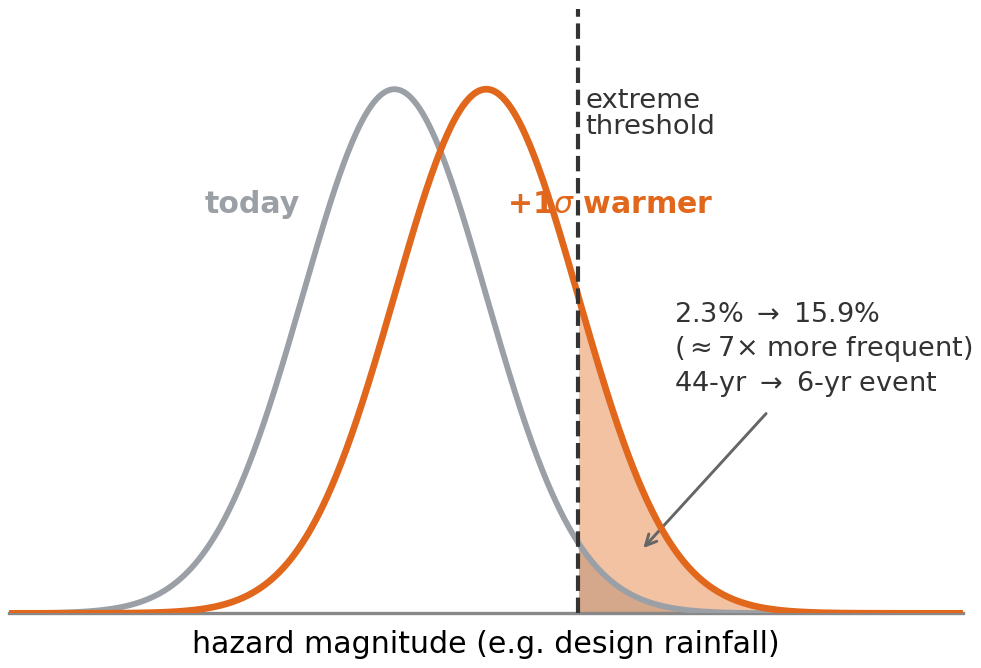
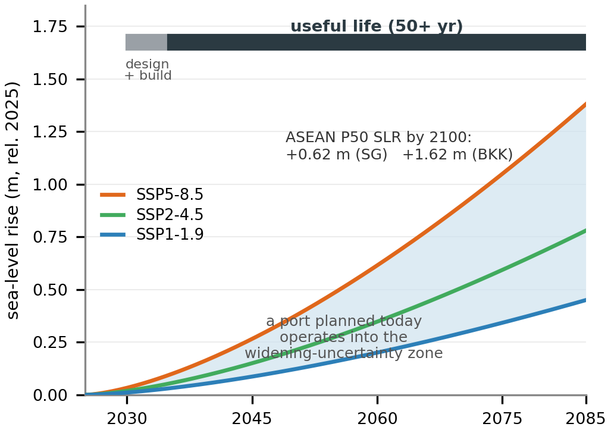
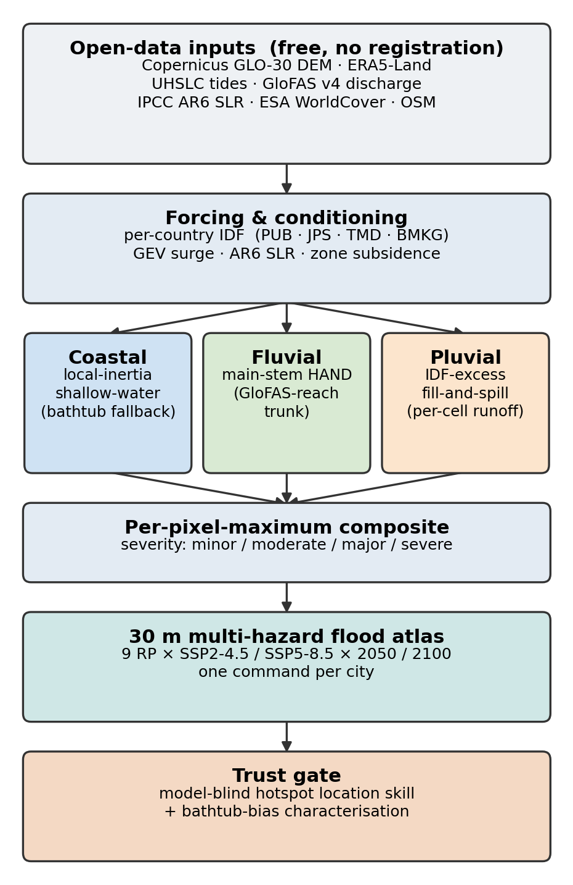
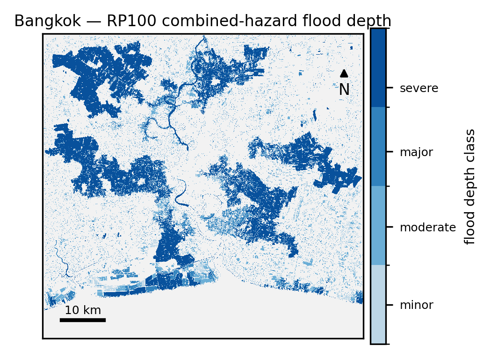
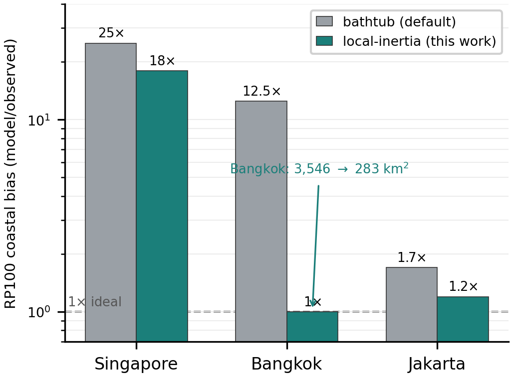

# Forward-Looking, Open Multi-Hazard Flood Screening as Strategic Decision Support for Critical Infrastructure in Under-Resourced Southeast Asian Cities

**Authors:** Withheld for double-blind review
**Affiliation:** Withheld
**Anonymized artifact:** `[anonymized-mirror]` (de-anonymized repository provided on acceptance)
**Venue:** IEEE R10-HTC 2026 — Special Session 1 "Net Zero Integration"
**Format:** IEEE conference template, two-column, ~6 pages. Source of record: `docs/paper/draft.md` (extended journal form).

---

## Abstract

The Southeast Asian cities most exposed to flooding are precisely those least able to obtain usable hazard information, and they are also where the region's critical port infrastructure and trade chokepoints concentrate. The only comparable-resolution (30 m) three-hazard regional model is commercial and closed, and its free tranche excludes the major ASEAN megacities; bespoke engineering studies are rarely published openly; and open global products are an order of magnitude coarser and omit the pluvial hazard that dominates urban flooding here. We present an open-source, open-data pipeline producing design-event coastal, fluvial, and pluvial flood-depth maps at 30 m for Singapore, Kuala Lumpur, Bangkok, and Jakarta, under four climate combinations (SSP2-4.5/SSP5-8.5 × 2050/2100). Every input is freely accessible, and the pluvial hazard is anchored to each national meteorological service's published Intensity–Duration–Frequency (IDF) standard, closing a 28–62 % deficit that global synthetic rainfall carries over tropical-convective extremes relative to those national curves. We make the model trustworthy as well as reproducible. A pre-defined, model-blind hotspot location-skill gate yields statistically significant discriminative skill (true-skill-statistic confidence interval excluding zero) in all four cities; one of four meets the stricter joint sensitivity/specificity PASS bar. A bathtub coastal over-prediction of 1.7–25× at RP100 is structurally corrected by a local-inertia shallow-water solver (Bangkok 12.5× to ≈1×; 3,546 → 283 km²). Framed through the lens of climate-adjusted strategic decision-making, the release is offered as a public good for the municipal disaster-management, adaptation, and port-planning agencies that cannot license commercial models.

**Index Terms —** humanitarian technology, flood risk, open data, multi-hazard, decision support, climate adaptation, ports, Southeast Asia.

---

## I. Introduction

Southeast Asia contains six of the ten cities globally most exposed to coastal flooding by 2100 under high-emission scenarios. Roughly 750 million people live in the ASEAN region, with about a fifth of regional GDP on flood-exposed land [1]. The stressors compound: AR6 median sea-level rise (SLR) under SSP5-8.5 by 2100 ranges from +0.62 m (Singapore) to +1.62 m (Bangkok) [2]; tropical convective rainfall intensifies at or above the Clausius–Clapeyron rate [3]; and several megacities subside at 1–25 cm yr⁻¹ [4], [5], [6]. The 2011 Thailand megaflood, the 2020 Jakarta monsoon floods, and the 2021 Kuala Lumpur flash floods are recent reminders that the exposure is multi-hazard (coastal, fluvial, and pluvial) and concurrent [7], [8].

These same cities anchor global trade. Maritime transport carries over 80 % of world trade by volume, and ASEAN hosts both top-tier ports (Singapore, Port Klang, Tanjung Priok, Laem Chabang) and the Strait of Malacca chokepoint. Ports are critical infrastructure with a multi-year planning phase and a 50-year-plus useful life, so an asset designed today will operate well into the zone of large climate uncertainty [9], [10]. Present-day multi-hazard damage to global port infrastructure already has an expected value at risk of about $7.6 billion per year (range $4.0–17.4 billion), and roughly 80 % of ports are exposed to flooding (coastal, rainfall, and riverine) [11]. First-order flood screening is the cheapest input to the resulting trillion-dollar adaptation question, yet it is exactly what under-resourced ASEAN municipalities cannot obtain.

Existing tools fall into three categories, none of which simultaneously offers high resolution, multi-hazard scope, open code, open data, and per-country calibration (Table I). The only 30 m three-hazard global model is commercial [12], and its free tranche excludes the major ASEAN megacities. Bespoke municipal studies are typically proprietary and seldom published in a form others can reproduce. Open global alternatives are an order of magnitude coarser (~10 km) and lack the pluvial layer that drives most urban flood damage in the region [13], [14], [15]. The result is an equity gap: open, high-resolution, multi-hazard flood information is unavailable to the agencies that most need it.

This paper addresses that gap. We present an open-source, open-data, per-country-calibrated 30 m multi-hazard flood pipeline and atlas for four ASEAN cities, validate that it locates real floods, and tighten every claim to the evidence that supports it. We also frame the contribution as forward-looking decision support: in a "new climate era," planning by extrapolating historical flood frequencies systematically under-prices tail risk, and a scenario- and return-period-conditioned screen is the corrective.

**Academic contributions.** The released atlas is a resource contribution: to our knowledge it is the first open, reproducible, per-country-calibrated 30 m three-hazard flood product for the region. Its scholarly value, however, lies in four findings that are transferable beyond our four-city release:

1. *A pre-registered, model-blind location-skill protocol for open flood screening.* A frozen register of documented-flooded and documented-dry localities is scored by the true-skill statistic with a bootstrap confidence interval, under an explicit separation between significant skill and a stricter PASS bar and a dry-control discipline that forbids retuning. We show the protocol transfers across four cities with no engine changes, turning "reproducible" into the stronger, testable claim "demonstrably skilful."
2. *A quantified characterisation and structural correction of bathtub bias in 30 m open coastal screening.* The connectivity (bathtub) solver that is the default in open tools over-predicts inundation at the 100-year return period (RP100) by 1.7–25×; we show this is a solver-architecture artifact, removed by a local-inertia shallow-water solver (Bangkok 12.5×→1×), rather than a 30 m data-resolution limit. This is a reusable caution for any 30 m open coastal screen on deltaic terrain.
3. *Per-country Intensity–Duration–Frequency (IDF) anchoring to close the tropical-convective pluvial deficit.* We quantify a 28–62 % shortfall of global-synthetic design rainfall against four national IDF standards and give a two-anchor recipe that eliminates it, the single most important in-region calibration for the pluvial layer that global products omit.
4. *A main-stem-HAND referencing rule, with its failure boundary.* HAND must be referenced to the trunk channel the modelled discharge represents (a 180 km² accumulation trunk) rather than a channel-initiation threshold or the full OSM network; we validate this against the skill gate and delimit where single-stage HAND fails (flat deltas fed by an out-of-domain mega-river).

Each is stated as a finding others can reuse independently of our specific release; the conceptual contribution, reframing screening as forward-looking, distribution-aware decision support (§II), ties them to the planning problem they serve.

**Table I.** Comparator landscape for ASEAN-relevant flood-screening tools.

| Tool | Resolution | Hazards | Open code / data | Per-country IDF |
|---|---|---|---|---|
| **This work** | **30 m** | **C + F + P** | **Yes / Yes** | **Yes (4 services)** |
| Fathom 3.0 [12] | 30 m | C + F + P | No / No | Global synthetic† |
| Aqueduct Floods 4.0 [13], [14] | ~10 km | C + F | Method / Yes | None |
| GLOFRIS / PCR-GLOBWB [15] | ~10 km | F (+C) | Yes / Yes | None |
| City engineering studies | High | Various | No / No | Per-city |

†Fathom's free tranche (accessed and verified 2025; a dated snapshot is pinned for review) is restricted to selected developing countries and excludes the major ASEAN megacities covered here. The comparison axis here is *openness and access* rather than accuracy: Fathom is bare-earth (FABDEM/FABDEM+) and engineering-validated, and its terrain treatment directly addresses the DSM-driven bias we characterise in §V; we claim open reproducibility for cities its free tranche omits rather than terrain or skill parity. C = coastal, F = fluvial, P = pluvial.

---

## II. Decision Context: Why Screening Must Be Forward-Looking

Infrastructure optimised for the twentieth-century climate now faces conditions outside its design envelope: roads buckling in unprecedented heat, drainage overwhelmed by rainfall beyond prior high-water marks [16]. The core reason is a property of shifting distributions rather than of any single forecast. As a hazard distribution shifts warmer, the frequency of extremes grows much faster than the mean. Figure 1 makes this concrete with a schematic Gaussian shift: a mean shift of one standard deviation raises the probability of exceeding a "+2σ" threshold from 2.3 % to 15.9 %, roughly a 7× jump that turns a 44-year event into a 6-year event, even though the average moved only modestly [17]. (The 2.3 %/15.9 % values are the normal-distribution tail beyond 2σ and 1σ; the figure illustrates the mechanism rather than a specific IDF curve.) A planner who screens flood risk by extrapolating the historical record therefore systematically under-prices the tail. The corrective is to screen on return periods and explicit climate scenarios, which is exactly the surface our atlas provides.

The decision relevance is sharpened by the long life of the assets at risk (Figure 2). A port entering planning today is completed in the mid-2030s and operates into the 2080s, by which point SSP-pathway divergence is wide: median ASEAN SLR by 2100 spans +0.62 to +1.62 m, with larger high-end ranges. Two further realities frame how the screen will be used. First, adaptation planning lags decarbonisation: among the largest global ports, 89 % (31/35) have mitigation plans but only 66 % (23/35) have adaptation plans [9]. Second, hard remediation is slow and costly: the U.S. Coastal Texas ("Ike Dike") barrier is projected at $57 billion over a 20-year build [18], so a cheap, open, comparable screen is the rational first move before any such commitment. Global port investment to keep pace with SLR and trade growth is estimated at $223–768 billion by 2050 [10]; deciding *where* to spend it begins with screening.

**Figure 1.** Climate "math" for screening. A schematic mean shift of one standard deviation produces a large, non-linear increase in the frequency of threshold exceedances (here ≈7×). Static extrapolation of the historical record under-prices the tail; return-period, scenario-conditioned screening does not.

**Figure 2.** Asset life versus scenario uncertainty. A port planned today operates through the 2080s, deep inside the widening SLR fan (SSP1-1.9 / SSP2-4.5 / SSP5-8.5; ASEAN P50 endpoints +0.62 m SG, +1.62 m BKK from [2]). The screen exists to make that fan, across SSP and horizon, legible to a planner before capital is committed.

---

## III. Open Multi-Hazard Pipeline

**Open-data inputs.** A per-city configuration drives a single orchestration script through the pipeline (Figure 3). Every input is free and most require no registration: the Copernicus GLO-30 DEM (via the Microsoft Planetary Computer), ERA5-Land precipitation [19] (Open-Meteo), University of Hawaii Sea Level Center (UHSLC) tide gauges, GloFAS v4 discharge reanalysis [20] (Open-Meteo Flood API), IPCC AR6 sea-level projections [2] (NCAR/Rutgers Zarr), ESA WorldCover 2021 land cover [21], and OpenStreetMap waterways. The implementation is pure Python on the scientific stack (rasterio, scipy, pyproj, pysheds, numba); no external binaries or licensed data are required, which is what makes third-party rebuild from scratch possible. (CMEMS mean-dynamic-topography offsets, used only as static per-gauge scalar datum corrections, are the single input requiring registration; this is disclosed and does not gate bulk reproduction.)

**Per-country IDF anchoring.** The most important in-region calibration is the pluvial design rainfall. Global synthetic rainfall statistics under-represent tropical-convective extremes. We quantify this per service as the relative shortfall of the global-synthetic depth against the national IDF curve at matched duration and return period; across the four services (PUB, JPS-MSMA, TMD-RID, BMKG) the deficit spans 28–62 %. As an illustrative single cell, a national 6-hour 100-year design depth of ~250 mm against a global-synthetic ~155 mm is a 38 % shortfall, a gap that propagates directly into ponding depth. We therefore fit a two-anchor Gumbel distribution to each country's published standard. We stress that two (return period, depth) anchors *exactly determine* Gumbel's two parameters: this is exact determination rather than a regression fit, so RP100 depends entirely on anchor placement. We anchor at each service's published 2-year and (where available) 100-year design points, making RP100 a near-interpolation where a 100-year point is published and a mild extrapolation otherwise; the storm duration is matched to the dominant local mechanism (1-hour secondary-drain for Singapore's sub-hourly convective bursts, 6-hour elsewhere).

**Three hazards.** *Coastal:* a GEV fit to UHSLC annual-maximum storm-surge residuals (T_TIDE-detided [22]), consistent with global surge reanalyses [23], [24], plus the AR6 SLR delta, datum-aligned via a CMEMS mean-dynamic-topography offset, and routed by a local-inertia shallow-water solver [25] on a staggered grid; a connectivity bathtub solver is retained only as a fallback where the sea is enclosed within the DEM domain. *Fluvial:* the GloFAS design discharge at the matched return period is converted to a design stage through a Manning-type uniform-flow rating on the reach-trunk geometry, with bankfull stage subtracted for rivers carrying permanent baseflow; the residual is mapped via Height Above Nearest Drainage (HAND) [26], [27] referenced to the **main-stem trunk the modelled discharge represents** (for Kuala Lumpur, the ≥ 180 km² accumulation trunk) rather than a channel-initiation threshold or raw OSM network, which over-broaden the floodplain. We flag a scale caveat: GloFAS at its native resolution is a coarse instrument for an urban trunk, so fluvial outputs are screening-grade. *Pluvial:* the IDF excess is routed by a catchment-routed fill-and-spill cascade [28] (depressions resolved by a Planchon–Darboux fill [29]) with a per-cell runoff coefficient from WorldCover land cover. This is a steady-state method without hydrograph timing or infiltration dynamics; we report it as a known structural limit of the pluvial layer (§VII). The three depth rasters are composited by per-pixel maximum.

**Scenarios and subsidence.** All hazards are produced for SSP2-4.5 and SSP5-8.5 at 2050 and 2100 on a subsidence-corrected DEM. The zone-based correction applies documented post-2013 rates (up to ~25 cm yr⁻¹ in the worst north-Jakarta zones and ~1–2 cm yr⁻¹ in Bangkok), accumulated to the horizon. In north Jakarta this contributes on the order of 1 m by 2050, rivalling or exceeding the SLR signal, so the subsidence component is reported separately and flagged for sensitivity rather than buried in the forcing.

**Figure 3.** Pipeline data flow: free open-data inputs → forcing & conditioning (per-country IDF, GEV surge + AR6 SLR, zone subsidence correction) → per-hazard solvers (inertial coastal, main-stem-HAND fluvial, fill-and-spill pluvial) → per-pixel-maximum composite and severity classification → trust gate.

---

## IV. The Open Flood Atlas

At the canonical RP100 / SSP5-8.5 / 2100 combination, the atlas shows the expected physical contrast between cities (Table II): low-lying Bangkok is coastal-dominated under the raw solver, Jakarta fluvial/pluvial, and inland Kuala Lumpur pluvial. Crucially, the headline combined extent is sensitive to the coastal solver. The bathtub coastal layer over-predicts (§V), so we present coastal extents both ways. Substituting the inertial layer collapses Bangkok's combined extent from 3,598 to ≈900 km²; it ceases to be coastal-dominated and becomes fluvial-bounded. A planner should read the inertial column; the bathtub column is shown only to expose the correction.

**Table II.** Combined flood extent at RP100, SSP5-8.5 / 2100 (km²). Coastal shown as bathtub → inertial.

| City | Coastal | Fluvial | Pluvial | Combined‡ | Dominant |
|---|---:|---:|---:|---:|---|
| Singapore | 67 → 48§ | 112* | 19 | 184 | canal + coast |
| Kuala Lumpur | 0 → 0 | 126 | 268 | 362 | pluvial |
| Bangkok | 3,546 → **283** | 788 | 433 | ≈900 | fluvial |
| Jakarta | 159 → 112 | 389 | 169 | 560 | fluv. + pluv. |

Inertial coastal = bathtub × (inertial bias / bathtub bias) from Figure 4. ‡Combined uses the *inertial* coastal layer for every row (per-pixel maximum of the inertial composite); Bangkok combined is the headline correction (bathtub combined was 3,598). §Singapore's documented present-day coastal baseline is near zero, so its residual ratio is an artefact (§V). *Singapore's "fluvial" layer is PUB primary canal-overflow under long-duration design rainfall rather than natural-river flooding, a definitional caveat that limits cross-city comparability of this column.

**The mitigation delta, corrected.** The cleanest single number for an adaptation planner is the mitigation delta, the flooded area avoided by meeting the lower-emissions pathway. On the bathtub layer, the avoided Bangkok coastal RP100 land (SSP2-4.5 vs SSP5-8.5 at 2100) is −133 km². Such deltas are sometimes assumed robust to absolute bias, but that holds only for additive offsets. The bathtub bias is *multiplicative* (~12.5× for Bangkok), so the difference of two inflated extents is itself inflated: computed on the corrected inertial layer the avoided area is ≈11 km², an order of magnitude smaller. The sign and policy direction (avoidance under lower emissions) are robust; the magnitude carries the residual bias and must be read off the inertial layer. We report both.

**Figure 5.** Combined-hazard RP100 flood-depth map for Bangkok on the inertial composite (present-day SSP5-8.5 baseline), illustrating the screening flood envelope. Depth classes: minor (0.1–0.15 m), moderate (0.15–0.5 m), major (0.5–1 m), severe (> 1 m).

---

## V. Validation and Trustworthiness

An open model is useful only if it can be trusted to flood where flooding actually occurs. We test this with a **pre-defined, model-blind documented-hotspot location-skill gate**. For each city we freeze, before consulting any model output, a register of localities with documented flooding (positives) and localities documented to have stayed dry (controls), each geocoded and DEM-verified. The combined present-day wet mask (pluvial ∨ fluvial ∨ coastal, ≥ 0.10 m, within a 50 m hit radius matching geocoding precision) is scored against the register at the event-matched RP100, reporting hit-rate (HR; sensitivity), correct-reject-rate (CRR; specificity), and the true-skill statistic (TSS = HR + CRR − 1) with a BCa bootstrap 95 % confidence interval (10,000 resamples); the 2×2 association is corroborated by Fisher's exact test.

**Table III.** Documented-hotspot gate (present-day, RP100, ≥ 0.10 m, 50 m radius). PASS = HR ≥ 0.70 ∧ CRR ≥ 0.70 ∧ TSS CI > 0.

| City | pos / dry | HR | CRR | TSS [95 % CI] | verdict |
|---|---|---:|---:|---|---|
| Kuala Lumpur | 17 / 7 | 0.76 | 0.86 | **0.62** [0.25, 0.88] | **PASS** |
| Singapore | 38 / 20 | 0.82 | 0.65 | **0.47** [0.21, 0.72] | sig.; CRR < .70 |
| Bangkok | 16 / 7 | 0.56 | 0.86 | **0.42** [0.04, 0.75] | sig.; HR < .70 |
| Jakarta | 18 / 8 | 0.89 | 0.50 | **0.39** [0.03, 0.75] | sig.; CRR < .70 |

Jakarta is reported both ways: before the model-blind reclassification of two record-documented controls (Menteng, Gambir; inundated 2007 and 2013) TSS was 0.16 (no skill); after, 0.39. The reclassification was fixed on flood-record evidence before the first gate run, never to make the gate pass.

**Two reported bars, stated explicitly.** We distinguish two criteria that are easily conflated. *Significant discriminative skill* is the weaker condition that the TSS confidence interval excludes zero. *PASS* is the stricter, pre-registered bar HR ≥ 0.70 *and* CRR ≥ 0.70 *and* TSS CI > 0. All four cities meet the weaker condition; one (Kuala Lumpur) meets PASS (Table III). Because the gate is run in four cities, we note the family-wise context: Kuala Lumpur's PASS survives a Bonferroni-adjusted α = 0.0125, and so does the pooled register. We also acknowledge the small registers (24 / 58 / 23 / 26 points): the lower CI bounds of 0.03–0.04 for Bangkok and Jakarta are statistically significant but fragile, and we present them as such rather than as robust.

**Order of operations (no retuning).** Two design choices materially affect the gate, so we state their timing explicitly. (i) The main-stem-HAND trunk threshold (≥ 180 km² for Kuala Lumpur) was fixed by the physics of which channel the modelled discharge represents; it corrects a false positive on a 60–77 m hill and yields a credible floodplain. (ii) The Jakarta control reclassification was decided on the 2007/2013 flood record. Both were fixed before the first gate evaluation and anchored to documented facts rather than gate output; a genuine control that the model floods stays in the register as a reported false positive. We therefore report Jakarta's TSS both unreclassified (0.16) and reclassified (0.39) and carry both forward, rather than presenting only the favourable number. The remaining shortfalls are *documented structural limits rather than tuning failures*: Bangkok's HR is bounded because the 2011 reference flood was sourced from a catchment whose headwaters lie outside the model domain [30], and Jakarta's residual specificity loss is fill-and-spill over-ponding on genuinely elevated ground.

**Bathtub bias is structurally corrected.** A bathtub solver, the default in open screening tools, over-predicts documented present-day coastal inundation by 1.7–25× at RP100, because 30 m terrain cannot resolve the sub-pixel road raises, canals, and bunds that protect small present-day events. Replacing it with the local-inertia solver, where the sea connects to the domain boundary, brings the over-prediction to ≈1× (Figure 4): Bangkok's RP100 coastal extent drops from 3,546 to 283 km² (a 12.5× reduction). We benchmark this corrected layer against coastal-specific references (storm-surge and high-tide inundation footprints) rather than the 2011 compound megaflood, whose fluvial headwaters lie outside the model domain; the 2011 extent is reported only as a loose upper-envelope sanity check. The correction is architectural: Singapore's residual 18× ratio is an artefact of its near-zero documented baseline rather than a model failure.

**Figure 4.** Bathtub-bias factor (model / observed) at RP100 by city, with the local-inertia correction (log scale). The 12.5× Bangkok reduction to ≈1× (3,546 → 283 km²) is the headline; Singapore's residual ratio (≈18×) stays high only because its documented present-day coastal extent is near zero, and Jakarta's residual is ≈1.2×.

---

## VI. From Screening to Strategic Decisions

The atlas is a decision instrument, and its value tracks the decisions it informs. Three uses follow directly. *Triage:* 80 % of ports face flooding exposure and present-day port damage risk is ~$7.6 B yr⁻¹, with 32 % concentrated in cyclone-prone clusters such as the U.S. Gulf and Southeast Asia [11]; a comparable cross-city surface lets an agency rank its own sites before commissioning costly bespoke studies. *Scenario framing:* because the same solver and inputs are used for every city and scenario, cross-scenario deltas (read off the corrected layer) isolate the adaptation-relevant signal from absolute bias. *Sequencing under uncertainty:* with hard barriers costing tens of billions and taking decades, and with high-tide flooding days at exposed ports projected to rise sharply by 2050 [9], an open screen supports the choice between building now for a projected future and preserving option value to retrofit later. This is the practical content of "climate intuition": quantifying how the hazard distribution and the human response interact, and planning for the tail rather than the mean [16].

The equity argument is sharpened by this framing. The cities our atlas covers are not marginal: they host the region's largest ports and the Malacca chokepoint, exactly the assets a commercial model's free tranche omits. Lowering first-order flood information from a procurement question to a software install is therefore not only a humanitarian good but a trade-resilience one.

---

## VII. Impact and Limitations

The intended use is humanitarian: open, validated, reproducible hazard maps as decision support for municipal disaster-management, adaptation, and port-planning agencies that cannot license commercial models. The model is a screening upper bound under three explicit assumptions: no active pumping, no sub-pixel defences resolved by the 30 m DEM, and per-pixel-maximum (marginal rather than joint-exceedance) composition. Two findings bound transferability and are reported rather than tuned away: single-stage HAND does not transfer to flat deltas fed by an out-of-domain mega-river (Bangkok, Jakarta) [30], which bounds Bangkok's HR; and the pluvial fill-and-spill solver is steady-state and currently heterogeneous across cities (a documented homogenisation step), which explains residual specificity loss from over-ponding on elevated ground. We also note terrain as the dominant residual bias source: the GLO-30 DSM includes buildings and vegetation, which drives the bathtub over-prediction characterised in §V, so migrating to a free bare-earth product (FABDEM) is the named next step and would address the largest single error directly. Extending the bias-aware coastal treatment to fully enclosed-sea topologies, where the inertial solver's open-boundary wall condition does not directly apply, is the principal prerequisite for broader regional coverage.

---

## VIII. Conclusion

An open-source, open-data, per-country-calibrated 30 m multi-hazard flood atlas for ASEAN cities is feasible, reproducible from free data, and, by a pre-defined model-blind location-skill gate, shows statistically significant discriminative skill in all four cities tested, with one city meeting the stricter joint PASS bar and the coastal over-prediction structurally corrected so that every headline number is read off the corrected layer. By targeting exactly the cities that commercial high-resolution models exclude, and by framing the output as forward-looking decision support for critical infrastructure under deep climate uncertainty, the release is offered as a public good for humanitarian flood-risk reduction and an invitation to extend.

---

## Reproducibility

Code, per-city configuration, and the frozen validation registers (with their pre-reclassification labels) are released openly through an anonymized mirror for double-blind review; the de-anonymized repository is provided on acceptance, enabling third-party rebuild of every result from free data.

---

## References

<!-- References ordered by first citation in the text (IEEE convention). -->
[1] Asian Development Bank, "Asia in the Global Transition to Net Zero: Asian Development Outlook 2022 Thematic Report," 2022.
[2] B. Fox-Kemper et al., "Ocean, Cryosphere and Sea Level Change," in *Climate Change 2021: The Physical Science Basis (IPCC AR6 WGI)*, Cambridge Univ. Press, 2021.
[3] G. Lenderink, R. Barbero, J. M. Loriaux, and H. J. Fowler, "Super-Clausius–Clapeyron Scaling of Extreme Hourly Convective Precipitation and Its Relation to Large-Scale Atmospheric Conditions," *J. Climate*, vol. 30, pp. 6037–6052, 2017.
[4] E. Chaussard, F. Amelung, H. Abidin, and S.-H. Hong, "Sinking cities in Indonesia: ALOS PALSAR detects rapid subsidence due to groundwater and gas extraction," *Remote Sens. Environ.*, vol. 128, pp. 150–161, 2013.
[5] H. Z. Abidin et al., "Land subsidence of Jakarta (Indonesia) and its relation with urban development," *Nat. Hazards*, vol. 59, no. 3, pp. 1753–1771, 2011.
[6] N. Phien-wej, P. H. Giao, and P. Nutalaya, "Land subsidence in Bangkok, Thailand," *Eng. Geol.*, vol. 82, no. 4, pp. 187–201, 2006.
[7] S. Hallegatte, C. Green, R. J. Nicholls, and J. Corfee-Morlot, "Future flood losses in major coastal cities," *Nat. Clim. Change*, vol. 3, pp. 802–806, 2013.
[8] B. Tellman et al., "Satellite imaging reveals increased proportion of population exposed to floods," *Nature*, vol. 596, pp. 80–86, 2021.
[9] J.P. Morgan, "Sea Change: Port infrastructure, climate risks and the future of global trade," Climate Advisory, 2025.
[10] S. E. Hanson and R. J. Nicholls, "Demand for ports to 2050: climate policy, growing trade and the impacts of sea level rise," *Earth's Future*, vol. 8, no. 8, e2020EF001543, 2020.
[11] J. Verschuur, E. E. Koks, S. Li, et al., "Multi-hazard risk to global port infrastructure and resulting trade and logistics losses," *Commun. Earth Environ.*, vol. 4, art. 5, 2023.
[12] O. E. J. Wing et al., "A 30 m global flood inundation model for any climate scenario," *Water Resour. Res.*, vol. 60, e2023WR036460, 2024 (free-access tier accessed 2025; dated snapshot pinned).
[13] R. W. Hofste, P. Reig, and L. Schleifer, "Aqueduct 3.0: Updated Decision-Relevant Global Water Risk Indicators," World Resources Institute Tech. Note, 2019.
[14] P. J. Ward et al., "Aqueduct Floods: global flood risk maps and analysis," World Resources Institute Tech. Note, 2020.
[15] E. H. Sutanudjaja et al., "PCR-GLOBWB 2: a 5 arcmin global hydrological and water resources model," *Geosci. Model Dev.*, vol. 11, pp. 2429–2453, 2018.
[16] J.P. Morgan, "Navigating the New Climate Era: Building Intuition for Strategic Decision-Making," Climate Intuition, 2025.
[17] R. N. Patel, D. B. Bonan, and T. Schneider, "Changes in the frequency of observed temperature extremes largely driven by a distribution shift," *Geophys. Res. Lett.*, vol. 51, no. 24, e2024GL110707, 2024.
[18] U.S. Army Corps of Engineers, "Coastal Texas Protection and Restoration Feasibility Study (Final Report)," Galveston District, 2021 (revised cost estimate, 2023).
[19] J. Muñoz-Sabater et al., "ERA5-Land: a state-of-the-art global reanalysis dataset for land applications," *Earth Syst. Sci. Data*, vol. 13, pp. 4349–4383, 2021.
[20] L. Alfieri et al., "A global network for operational flood risk reduction (GloFAS)," *Environ. Sci. Policy*, vol. 84, pp. 149–158, 2018.
[21] D. Zanaga et al., "ESA WorldCover 10 m 2021 v200," Zenodo, 2022. doi:10.5281/zenodo.7254221.
[22] R. Pawlowicz, B. Beardsley, and S. Lentz, "Classical tidal harmonic analysis including error estimates in MATLAB using T_TIDE," *Comput. Geosci.*, vol. 28, pp. 929–937, 2002.
[23] S. Muis, M. Verlaan, H. C. Winsemius, J. C. J. H. Aerts, and P. J. Ward, "A global reanalysis of storm surges and extreme sea levels," *Nat. Commun.*, vol. 7, art. 11969, 2016.
[24] S. Muis et al., "A high-resolution global dataset of extreme sea levels, tides, and storm surges, including future projections," *Front. Mar. Sci.*, vol. 7, art. 263, 2020.
[25] P. D. Bates, M. S. Horritt, and T. J. Fewtrell, "A simple inertial formulation of the shallow water equations for efficient two-dimensional flood inundation modelling," *J. Hydrol.*, vol. 387, no. 1–2, pp. 33–45, 2010.
[26] A. D. Nobre, L. A. Cuartas, M. Hodnett, C. D. Rennó, G. Rodrigues, A. Silveira, M. Waterloo, and S. Saleska, "Height Above the Nearest Drainage — a hydrologically relevant new terrain model," *J. Hydrol.*, vol. 404, pp. 13–29, 2011.
[27] C. D. Rennó, A. D. Nobre, L. A. Cuartas, J. V. Soares, M. G. Hodnett, J. Tomasella, and M. A. Waterloo, "HAND, a new terrain descriptor using SRTM-DEM: Mapping terra-firme rainforest environments in Amazonia," *Remote Sens. Environ.*, vol. 112, pp. 3469–3481, 2008.
[28] R. Barnes, K. L. Callaghan, and A. D. Wickert, "Computing water flow through complex landscapes — Part 3: Fill–Spill–Merge: flow routing in depression hierarchies," *Earth Surf. Dynam.*, vol. 9, pp. 105–121, 2021.
[29] O. Planchon and F. Darboux, "A fast, simple and versatile algorithm to fill the depressions of digital elevation models," *Catena*, vol. 46, no. 2–3, pp. 159–176, 2002.
[30] D. Komori, S. Nakamura, M. Kiguchi, A. Nishijima, D. Yamazaki, S. Suzuki, A. Kawasaki, K. Oki, and T. Oki, "Characteristics of the 2011 Chao Phraya River flood in Central Thailand," *Hydrol. Res. Lett.*, vol. 6, pp. 41–46, 2012.
