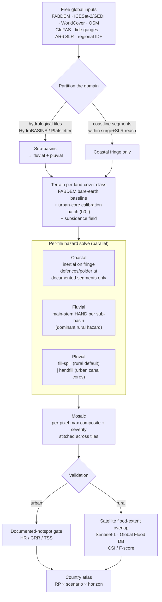

# Adding a New City — Principles & Method-Selection Runbook

A front-to-back guide for onboarding a new city into the open multi-hazard flood
atlas. It states **one governing principle**, the **DEM construction rule**, and the
**method-selection decision rule for each hazard** (coastal, fluvial, pluvial), then a
**front-to-back run sequence**. The aim: a new analyst can reproduce the method on a new
city by reading off objective local facts, with no free parameters tuned to the result.

---

## 0. The governing principle

> **One set of methodological principles is applied identically to every city, return
> period, and horizon. The apparent per-city differences are documented responses to
> objective local facts — never free parameters, and never tuned to the validation gate.**

Two corollaries that every step below obeys:

1. **Forcing-only variation across scenarios/RPs.** The model configuration (terrain,
   solver, masks) is held fixed across return periods and horizons; only the *forcing*
   changes (IDF rainfall, GEV surge + AR6 SLR delta, subsidence). If a knob has to move
   between RP10 and RP1000, it is a bug.
2. **Nothing is anchored to the gate.** Calibration parameters come from observed or
   published data (lidar, national IDF, tide gauge, design-standard defence crests). The
   documented-hotspot gate is **model-blind and frozen before scoring**, so it can never
   feed back into a parameter.

---

## 1. DEM — the terrain construction rule

Terrain is the dominant residual bias in any 30 m screen, so the flood surface is an
open, **license-clean bare-earth DEM**, not the building-and-vegetation Copernicus DSM.

**Default path — calibrate bare-earth:**

```
z_bare = z_DSM − b0 − h_building − f · h_canopy
```

- `z_DSM` = Copernicus GLO-30. `h_building` = Google Open Buildings footprint height.
  `h_canopy` = ETH global canopy-height model. Mask building cells and backfill from
  true-ground neighbours; subtract canopy; apply a city-specific subsidence delta.
- `b0` (flat true-ground offset) and `f` (canopy-penetration coeff, 0–1) are the **only**
  two free parameters. Fit them **per city** against held-out **ICESat-2 ATL08 + GEDI L2A**
  ground returns, reconciled to EGM2008. **Never transfer `b0`/`f` between cities.**
- Target: roughly halve mean-absolute error vs the DSM and remove its +1…+3 m high bias.

**The accuracy gate (decide accept vs correct vs substitute):**

| Held-out per-zone check | Verdict | Action |
|---|---|---|
| Urban-core bias within tolerance | **accept** | use the calibrated bare-earth |
| Urban core over/under-removed (sparse lidar) | **correct** | documented urban-core de-bias, anchored to lidar (not the gate) |
| Lidar ground truth itself too noisy to calibrate | **substitute** | see decision rule below |

> **DEM decision rule — calibrate vs substitute.**
> *If* the raw Copernicus-vs-lidar residual is already a few metres MAE (small, dense,
> heavily-reclaimed terrain where the lidar can't resolve the ground), **do not ship a
> noisy calibration.** Substitute the best independently-validated open bare-earth
> product (global **DeltaDTM**, ~0.45 m). *If* that product's vertical coverage caps below
> the terrain range (DeltaDTM caps at 30 m, so interior hills read 30 m against a true
> 50–85 m and collapse their height-above-drainage), **composite the out-of-range band
> from the surface model** and recompute HAND — a terrain-only, building-masked fix that
> leaves the flood-relevant low terrain on DeltaDTM. Add a **vertical-coverage-cap gate**
> to flag this case before flood use.

**Transferable lesson:** more accurate terrain improves the *risk* surface only when (a)
the urban core calibrates cleanly and (b) on defended deltas, documented pump/defence
physics are modelled alongside it. Otherwise more accurate data can quietly degrade the
screen (e.g. accurate low terrain leaking surge through sub-pixel dykes a real city pumps
dry). Provenance and coupled assumptions, not just resolution, belong in the disclosure.

*Worked examples:* Bangkok/Jakarta/KL → calibrate (urban-core gate catches Bangkok's
sparse-lidar over-removal). Singapore → substitute (DeltaDTM + DSM-hills composite).

---

## 2. Coastal — **inertial, not bathtub**

**Method: local-inertia shallow-water solver** (Bates 2010) on a staggered grid, seeded
from the open ocean. Depth = `peak_WSE − bed` (the full water column, so below-MSL
polders report their true depth).

> **Coastal decision rule — inertial vs bathtub.**
> **Always use the inertial solver for the product. The connectivity "bathtub" is computed
> only as the bias counterfactual, never shipped.** A bathtub fills every sea-connected
> cell below the water level, ignoring momentum and sub-grid conveyance; it over-predicts
> by a **defence-dependent** factor (full model domain, SSP5-8.5/2100 RP100: ~5.2× behind
> Bangkok's design dike, ~1.2× on Jakarta's undefended subsided coast). The gap is largest
> exactly where defences work. The inertial solver removes this **solver-architecture
> artifact** — it is not a 30 m resolution limit.
> **The one exception:** for a **fully enclosed-sea** topology (no open boundary for the
> solver's wall condition), the bathtub is the only available fallback — report it as a
> flagged limitation, not as a validated product.

**Required coastal inputs / rules:**

- **Sea mask (framefix):** restrict the seed to the open ocean, *not* the data-tile
  nodata border. A naïve NaN-flood-fill sweeps the nodata frame into "sea" and floods
  lateral land — run the frame-fix before solving.
- **Defences:** hold water back at documented continuous defence crests at each city's
  published design standard (reclamation/platform level, sea dike, coastal wall).
- **Pumped polders:** apply a dry floor **only where the bunded district is documented to
  stay dry** (e.g. Bangkok's King's-Dyke core); **omit it where the polders are themselves
  documented-flooded** (e.g. Jakarta's Pluit/Muara Baru). Defences must never manufacture
  dry land the flood record contradicts.

---

## 3. Fluvial — **main-stem HAND, not inertial**

**Method: Height Above Nearest Drainage** (HAND). Depth = `max(0, stage − HAND)`. The
GloFAS design discharge at the matched RP is converted to a design **stage** via a
Manning-type uniform-flow rating on the reach-trunk geometry (subtract bankfull for rivers
with permanent baseflow).

> **Fluvial decision rule — HAND vs inertial.**
> **Use HAND, not a 2D inertial fluvial solve.** The forcing is GloFAS design discharge —
> a coarse instrument for an urban trunk — so a momentum solver would manufacture
> precision the forcing can't support. HAND is the screening-grade, fast, terrain-driven
> map that matches the forcing fidelity. (Inertial is reserved for *coastal*, where surge
> propagation over flat deltas from an open sea boundary genuinely needs momentum +
> connectivity.)

> **HAND reference rule — main-stem trunk, not the dense network.**
> Reference HAND to the **main-stem trunk the modelled discharge represents** — a per-city
> flow-accumulation threshold (e.g. ≥180 km² for Kuala Lumpur). Referencing it to a
> channel-initiation threshold or the full OSM network floods every cell near any drain
> and over-broadens the floodplain.

**Failure boundary (report, don't tune):** single-stage HAND does **not** transfer to flat
deltas fed by an **out-of-domain mega-river** (Bangkok's Chao Phraya, Jakarta) — the
discharge headwaters lie outside the model domain, which bounds the hit-rate. State it as
a structural limit.

---

## 4. Pluvial — **fill-spill vs handfill (raingrid rejected)**

**Forcing:** IDF *excess* depth from the national IDF curve (two-anchor Gumbel, below),
routed by a scheme **matched to the city's dominant pluvial mechanism**.

> **Pluvial decision rule — match the scheme to the mechanism.**
>
> | City's flood mechanism | Scheme | How it works |
> |---|---|---|
> | **Depression-storage** — rain ponds in terrain hollows | **Fill-and-spill** cascade (Barnes 2021 FSM; Planchon–Darboux depression fill) + per-cell runoff coeff (WorldCover) | excess water fills depressions and spills downslope through the hierarchy |
> | **Canal-dense** — rain pools at low land beside a dense open-drain network | **HAND "handfill"** referenced to the dense drainage network, depth capped to documented flash-flood depth | excess raises a stage above the dense drains; low land beside them floods |

*Worked examples:* Bangkok, Kuala Lumpur → **fill-spill**. Singapore, Jakarta → **handfill**.

> **Why not rain-on-grid ("raingrid")?**
> A fully-distributed rain-on-grid alternative was tested and **does not recover the missed
> locations** (e.g. Bangkok's documented pluvial record). The binding limit is **30 m
> resolution and sub-daily timing**, not the routing scheme — so raingrid's extra cost buys
> nothing at screening grade. Choose fill-spill or handfill by mechanism; don't reach for
> raingrid.

**Caveat to carry:** the pluvial solver is steady-state (no hydrograph timing or
infiltration dynamics) and 30 m, so it under-resolves sub-daily, sub-30 m street flooding —
a documented resolution limit, especially for KL/Bangkok flash floods.

---

## 5. Forcing (the only thing that varies across scenario/RP)

- **Pluvial — per-country IDF anchoring.** Fit a **two-anchor Gumbel** to each national
  meteorological service's published IDF standard (two (RP, depth) anchors *exactly
  determine* Gumbel's two parameters — exact determination, not a regression fit). This
  closes a 28–62% deficit that global synthetic rainfall carries over tropical-convective
  extremes. Match storm duration to the local mechanism (e.g. 1-h for Singapore's
  sub-hourly convective bursts, 6-h elsewhere).
- **Coastal — surge + SLR.** GEV fit to tide-gauge annual-maximum storm-surge residuals
  (T_TIDE-detided) + the AR6 SLR delta, datum-aligned via a CMEMS mean-dynamic-topography
  offset.
- **Climate scaling.** A first-order GEV Clausius–Clapeyron rainfall intensification — a
  **uniform multiplier** `(1 + α·ΔT)` applied across return periods — plus the AR6 SLR
  delta. (Scaling GEV location+scale by the same α is RP-independent; it is *not*
  super-CC or return-period-specific.)
- **Subsidence.** Apply documented post-2013 rates accumulated to the horizon as a DEM
  delta; report it separately where it rivals SLR (north Jakarta), don't bury it.

---

## 6. Validation — the model-blind gate

- **Freeze a register before scoring:** documented-flooded localities (positives) and
  documented-dry localities (controls), each geocoded and DEM-verified. **Cardinal rule:**
  flooded controls and missed positives *stay* — the gate measures discrimination the
  model never saw.
- **Score** the combined present-day wet mask (pluvial ∨ fluvial ∨ coastal, ≥0.10 m,
  within a 50 m / ±2-pixel window) at the event-matched RP100: hit-rate (HR), correct-
  reject-rate (CRR), true-skill statistic (TSS = HR + CRR − 1) with a **stratified
  percentile bootstrap** 95% CI (positives and controls resampled independently).
- **Two bars:** *significant skill* = TSS CI excludes zero; **PASS** = HR ≥ 0.70 **and**
  CRR ≥ 0.70 **and** TSS CI > 0.
- **The gate validates extent/location, not depth.**

---

## 7. Front-to-back run sequence (new city)

1. **Scope.** Define the domain bbox + UTM CRS. Pull free inputs: Copernicus GLO-30,
   ICESat-2 ATL08 + GEDI L2A, ESA WorldCover, OSM waterways, GloFAS v4 discharge, UHSLC
   tide gauge, AR6 SLR (Zarr), national IDF standard.
2. **Terrain (§1).** Fit `b0`,`f` → bare-earth; run the per-zone accuracy gate;
   **accept / correct / substitute** per the DEM decision rule. Apply subsidence delta.
3. **Masks.** Sea mask (run **framefix**); main-stem river mask at the per-city
   accumulation threshold; drainage network; WorldCover runoff-coefficient raster.
4. **HAND.** Compute main-stem HAND on the bare-earth.
5. **Forcing (§5).** Two-anchor Gumbel IDF; GEV surge; AR6 SLR delta; subsidence delta →
   write `hazard_levels` per (scenario, RP).
6. **Pick the pluvial scheme (§4)** from the city's mechanism: depression-storage →
   fill-spill; canal-dense → handfill.
7. **Solve.** Coastal **inertial** (defences + polder rule, §2); fluvial **HAND** (§3);
   pluvial **chosen scheme** (§4). Composite by per-pixel maximum; classify severity.
8. **Validate (§6).** Freeze the register; score HR/CRR/TSS; report PASS vs significant.
9. **Compound layer.** Bracket the joint return level between independence
   (`1 − Π(1 − AEPᵢ)`) and a sum-of-marginals envelope; report depth amplification in the
   overlap zones.

**Per-city facts that drive each branch (fill this table for the new city):**

| Decision | Driving local fact | Choice |
|---|---|---|
| DEM calibrate vs substitute | raw Copernicus-vs-lidar MAE; reclamation density | …|
| Coastal defences/polder | documented continuous defences; which polders stay dry | … |
| Fluvial trunk threshold | which channel the GloFAS discharge represents | … (km²) |
| Fluvial in/out of domain | does the feeding mega-river's catchment lie inside the domain? | … |
| Pluvial scheme | depression-storage vs canal-dense mechanism | fill-spill / handfill |
| Pluvial duration | sub-hourly convective vs multi-hour | 1-h / 6-h |

---

## 8. Scaling to a country — and to less-built-up terrain

**Same rule set; the per-city constants of §§1–7 become spatial fields read off per tile.**
A country is a *tiled* run, and the "objective local facts" that drive each branch vary
continuously across it instead of being set once per city.

### 8.1 Tiling & orchestration

- **Fluvial + pluvial → hydrological tiles** (HydroBASINS / Pfafstetter sub-basins). HAND
  and fill-spill are cheap and embarrassingly parallel per basin.
- **Coastal → coastline segments.** Run the inertial solver **only on the coastal fringe**
  (cells within surge+SLR reach of the shore), each segment with its own open-sea
  boundary. The interior never gets a coastal solve — this is what keeps the one expensive
  component (inertial, ~30 min/RP/city) affordable at country scale.

### 8.2 Terrain for less-built-up land (the main change)

The bare-earth model of §1 is **building-bias-dominated**; rural terrain is
**canopy-dominated** (forest canopy is +20–40 m vs a building's few metres), and
ICESat-2/GEDI ground returns thin out under dense canopy — exactly where they are needed.
So **invert the default**:

- Use a **global bare-earth product (FABDEM)** — already forest-and-building-removed with
  ICESat-2/GEDI + ML — as the country baseline, and apply the per-city `(b0,f)`
  calibration of §1 **as a refinement patch only in dense urban cores** (building bias
  dominant, lidar denser).
- Where a local error model is fit, **stratify it by land-cover class / ecoregion**, not by
  "city" — the canopy term carries the correction in forested tiles.

### 8.3 Hazard differences in rural terrain

| Hazard | Rural difference | Net |
|---|---|---|
| **Coastal** | Most rural coast is **undefended**, so the bathtub↔inertial gap collapses (it was defence-dependent: ~1.2× undefended vs ~5.2× behind a dike). Still use inertial; defence/polder rules fire only at **documented** defended segments. | Simpler, cheaper to justify |
| **Fluvial** | HAND's **home turf** (it was built on rural floodplains). Natural rivers, no dense canal network, so the main-stem-vs-dense-network problem largely vanishes. Fluvial is the **dominant** rural hazard. | HAND works *better* |
| **Pluvial** | No dense drains → **handfill never triggers; fill-spill is the rural default**. Lower WorldCover runoff over vegetation/soil → pluvial correctly less dominant. Raingrid still rejected. | Fill-spill is the base case |

The pluvial rule therefore sharpens: **handfill is the urban-canal special case; fill-spill
is the base case.**

### 8.4 Forcing — regionalize what was national

- **IDF** per climate zone (or a gridded IDF product), two-anchor Gumbel *per zone* — one
  national curve won't represent a large country's climatic zones.
- **Surge** from multiple tide gauges around the coast, spatially interpolated — not one.
- **Subsidence** as a localized field (specific extracting basins), zero elsewhere — never
  a blanket rate.

### 8.5 Validation — add the satellite instrument

The hand-curated documented-hotspot register is labour-intensive and **urban-biased** and
won't cover a rural country. Augment it:

- **Urban:** keep the documented-hotspot gate (point HR / CRR / TSS).
- **Rural:** validate modeled RP-event extents against **observed satellite flood
  footprints** (Sentinel-1 SAR; Global Flood Database / Dartmouth Flood Observatory). The
  metric shifts from point skill to **areal overlap** (Critical Success Index / F-score;
  hit-rate + false-alarm-ratio). Satellite obs are densest exactly where hotspot records
  are sparsest — the two are complementary.

### 8.6 What stays the same vs what changes

| Stays identical | Becomes a spatial field / changes |
|---|---|
| The three solver choices (inertial coastal, HAND fluvial, fill-spill/handfill pluvial) | Per-city constants → per-tile / per-land-cover lookups |
| The governing principle (no gate-tuning; forcing-only variation) | Terrain default inverts to FABDEM + urban calibration patches |
| HAND main-stem reference; defence/polder rules | Defences fire only at documented segments (most rural is undefended) |
| Two-anchor Gumbel IDF method | IDF, surge, subsidence regionalized across the country |
| PASS = HR≥0.70 ∧ CRR≥0.70 (urban) | Add satellite-extent areal validation (rural) |

**Bottom line:** less-built-up terrain is in several ways *friendlier* to this method (HAND
on home turf, undefended coasts, natural depression storage) and is where bespoke studies
are most absent — highest marginal value. The two genuine new challenges are the
**canopy-dominated terrain correction** (→ FABDEM baseline + urban patches) and
**validation coverage** (→ satellite flood extents). Everything else is the same rule set,
tiled.

### 8.7 Country-scale orchestration flow

![Country-scale flood-atlas orchestration flow: free global inputs partition into hydrological sub-basins (fluvial/pluvial) and coastline segments (coastal fringe only); terrain is a FABDEM bare-earth baseline with per-urban-core calibration patches; each tile runs the inertial coastal, main-stem HAND fluvial, and fill-spill/handfill pluvial solvers in parallel; tiles are mosaicked by per-pixel maximum, validated by an urban hotspot gate and rural satellite flood extents, and assembled into a country atlas across return period, scenario, and horizon.](figures/country-scale-flow.svg)

<details>
<summary>Diagram source (mermaid)</summary>



</details>
